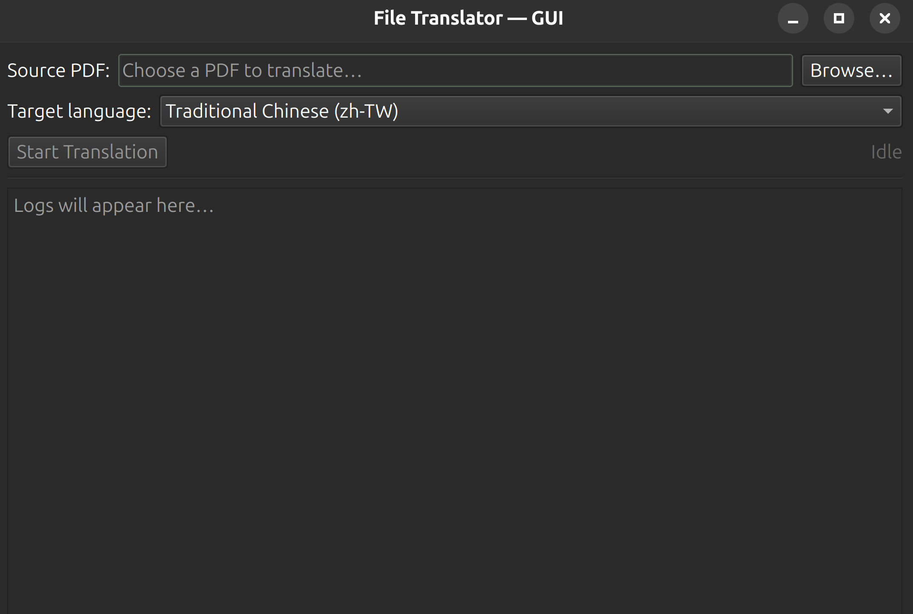

# PDF Translator

A specialized tool that transforms English PDF documents into multiple languages using Google's Gemini AI. This application intelligently processes PDFs by extracting both textual content and visual elements, then generates high-quality LaTeX code that maintains the original document's layout while providing accurate translations, finally, it compiles the LaTeX code to PDF. 


## Features

- **PDF Processing**: Extract text with huggingface model "facebook/nougat-base" and convert pages to images
- **AI-Powered Translation**: Generate LaTeX code using Google Gemini AI
- **LaTeX Compilation**: Automatically compile LaTeX to PDF using XeLaTeX
- **Structured Output**: Organized directory structure for images, text, LaTeX, and output PDFs

## Requirements

- Python 3.8+
- Google Gemini API key
- LaTeX distribution with XeLaTeX
- Poppler (for pdf2image to convert PDF pages to images)
- PySide6 (for the GUI app)
- (Optional) [uv](https://github.com/astral-sh/uv) for faster virtual environment and dependency management

## Installation

1. Clone the repository:
   ```bash
   git clone https://github.com/chyhsu/stats507-coursework.git
   cd stats507-coursework
   ```

2. Create and activate a virtual environment (choose one):

   - **Option A: Using uv (if installed)**
     ```bash
     uv venv venv
     source venv/bin/activate  # On Windows: venv\Scripts\activate
     ```

   - **Option B: Using plain Python venv**
     ```bash
     python -m venv venv
     # On Linux/macOS
     source venv/bin/activate
     # On Windows (PowerShell or cmd)
     venv\Scripts\activate
     ```

3. Install dependencies:
   ```bash
   pip install -r requirements.txt
   ```

4. Install Poppler (required by pdf2image for PDF→image conversion):
   - **macOS**: `brew install poppler`
   - **Ubuntu/Debian**: `sudo apt install poppler-utils`
   - **Windows**: Install from https://github.com/oschwartz10612/poppler-windows/releases (add the bin folder to PATH)

5. Install LaTeX distribution:
   - **macOS**: `brew install --cask mactex` or download from [MacTeX website](https://www.tug.org/mactex/)
   - **Windows**: Install [MiKTeX](https://miktex.org/download) or [TeX Live](https://tug.org/texlive/windows.html)
   - **Linux**: `sudo apt install texlive-xetex texlive-fonts-recommended texlive-fonts-extra`

6. Create a `.env` file with your Gemini API key:
   (You can get a free API key from [Google Gemini](https://makersuite.google.com/app/apikey) for free)
   ```
   GEMINI_API_KEY=your_gemini_api_key_here
   ```

## Usage

### GUI

1. Run the GUI:
   ```bash
   python main.py
   ```
2. Click Browse to choose a PDF.
3. Select the target language (default: Traditional Chinese zh-TW).
4. Click Start Translation. Progress and logs appear in the window.



### Outputs

- Extract images to `img/[filename]/`
- Extract text to `text/[filename]/`
- Generate LaTeX in `latex/[filename]/[filename].tex`
- Create translated PDF in `translated_pdf/[filename]/[filename]_[language].pdf`

## Project Structure

```
stats507-coursework/
├── main.py             # Entry point for running the GUI
├── gui_app.py          # PySide6 GUI implementation
├── file_translator.py  # High-level translation pipeline
├── model/
│   ├── __init__.py     # Gemini API key loading and exports
│   ├── model.py        # Gemini client + prompt invocation
│   └── prompt.py       # System prompt for LaTeX-generating translator
├── util/
│   ├── __init__.py     # Utility exports
│   ├── latex.py        # LaTeX to PDF compilation helpers
│   └── file.py         # PDF → images/text and LaTeX parsing utilities
├── img/                # Extracted page images from PDFs(auto-generated)
├── text/               # Extracted text/markdown from PDFs(auto-generated)
├── latex/              # Generated LaTeX source files(auto-generated)
├── translated_pdf/     # Final translated PDF outputs(auto-generated)
├── requirements.txt    # Python dependencies
├── pyproject.toml      # Project metadata and dependency list
└── .env                # Environment variables (Gemini API key) (generated by you)
```

## Troubleshooting

- **LaTeX Compilation Errors**: Ensure XeLaTeX is installed and in your PATH
- **API Key Issues**: Verify your Gemini API key in the `.env` file
- **Path Problems**: Use absolute paths or ensure correct relative paths
- **Poppler not found**: If image extraction fails (pdf2image errors), install Poppler and ensure it's on your PATH (see Installation step 4)

## License

[MIT License](LICENSE)

## Acknowledgements

- Google Gemini AI for providing the translation capabilities
- The LaTeX community for the document formatting system
